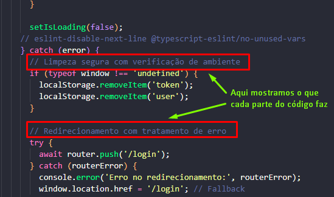

# Sobre os comentários **MUITO IMPORTANTE**

# O que são comentários? São linhas do código que são ignoradas pelo interpretador, ou seja, não vai aparecer no resultado do código

# Como usar? Para comentar uma linha usamos // e para comentar várias linhas /* */

# Exemplo de uso: let valor = 7 // * 4 + 3 + 2 + 1 tudo depois do // foi comentado, ou seja, não vai gerar nada. nesse exemplo de uso, se testar no console: valor vai retornar 7

# Para que servem? Comentários são usados para auxiliar na compreensão do codigo, entender pra que cada parte do codigo serve, deixar anotações e também documentar o código

# Comentários são usados diversas vezes por programadores para realizar um código

# FAZER QUIZ 01