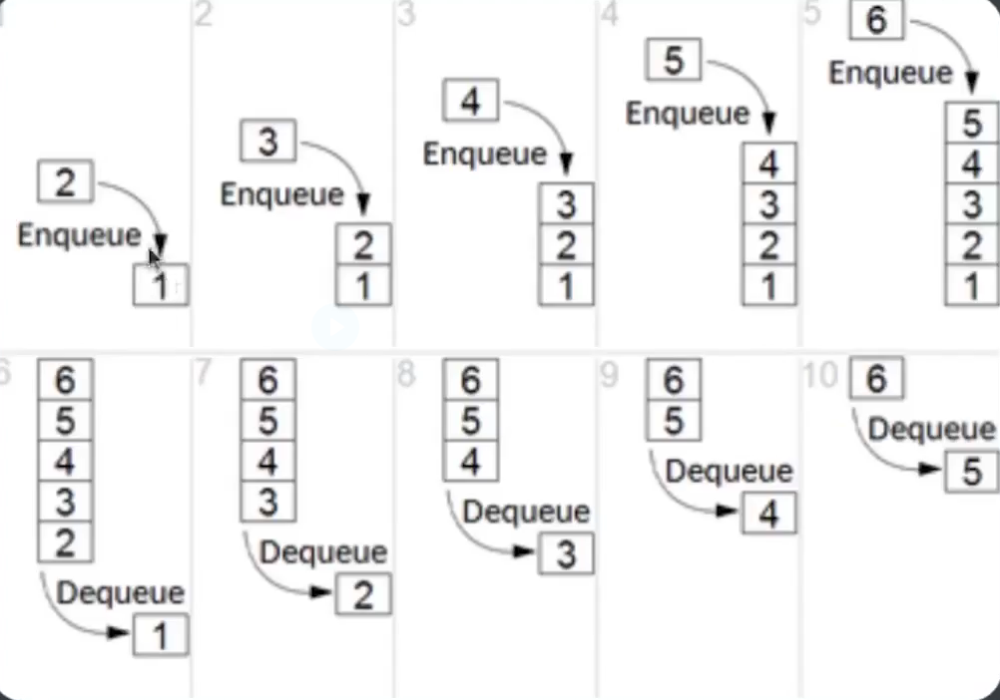
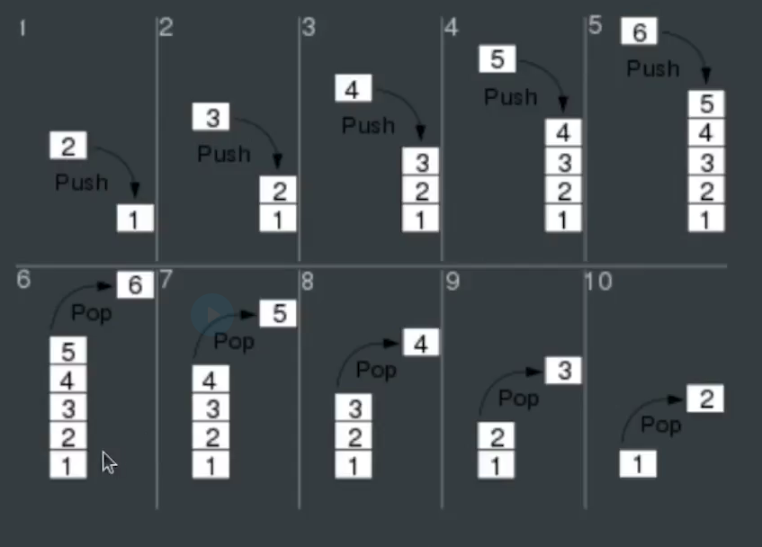
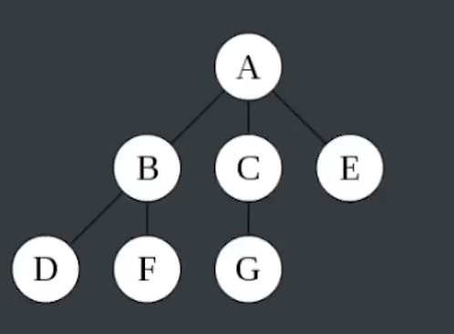
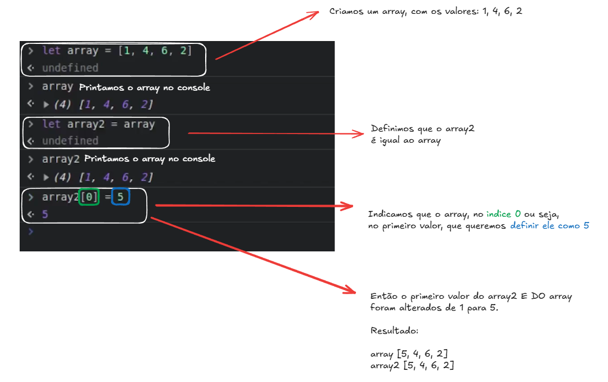

## Estrutura de dados

## São um modo particular de armazenar e organizar dados de modo que possam ser usados eficientemente, facilitando sua busca e modificação.

## Estrutura dos dados clássicos: 

Lista ligada -> Coleção ordenada de valores onde cada elemento aponta para o próximo 

Array -> Coleção de elementos que podem ser identificados pelo índice

Fila (Queue) -> Coleção de elementos onde o primeiro elemento a ser retirado deve ser o primeiro elemento adicionado. Também chamadas de FIFO (First-in First-out / Primeiro a entrar é o Primeiro a sair)

Pilha (Stack) -> Coleção de elementos onde o primeiro elemento a ser retirado deve ser o último elemento a ser adicionado. Também chamadas de LIFO (Last-in First-out / Ultimo a entrar é o Primeiro a sair)

Árvore (Tree) -> Conjunto de elementos chamados de nós (ou nodes) organizados em estrutura hierárquica (Não sequencial), ou seja, podendo estar "abaixo" ou "acima" de outros nós. Pense em uma árvore genealógica, na estrutura das pastas no seu computador ou na estrutura de uma página HHTML.

## Estrutura de dados no JS (E outras linguagens de alto nível)

Listas (Arrays)

Dicinários (Objetos)

## Valor e Referência 

o array2 mudou o valor a qual ele está referenciando, ou seja, ele tem referencia no array - Então se ele altera o primeiro valor, o array também é alterado