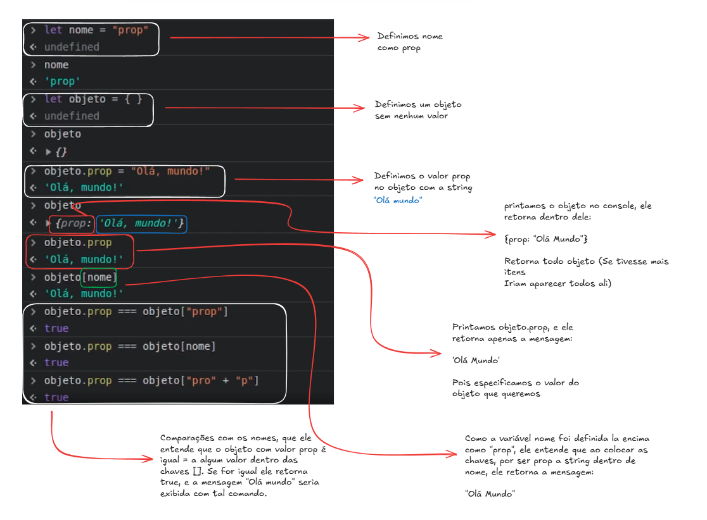
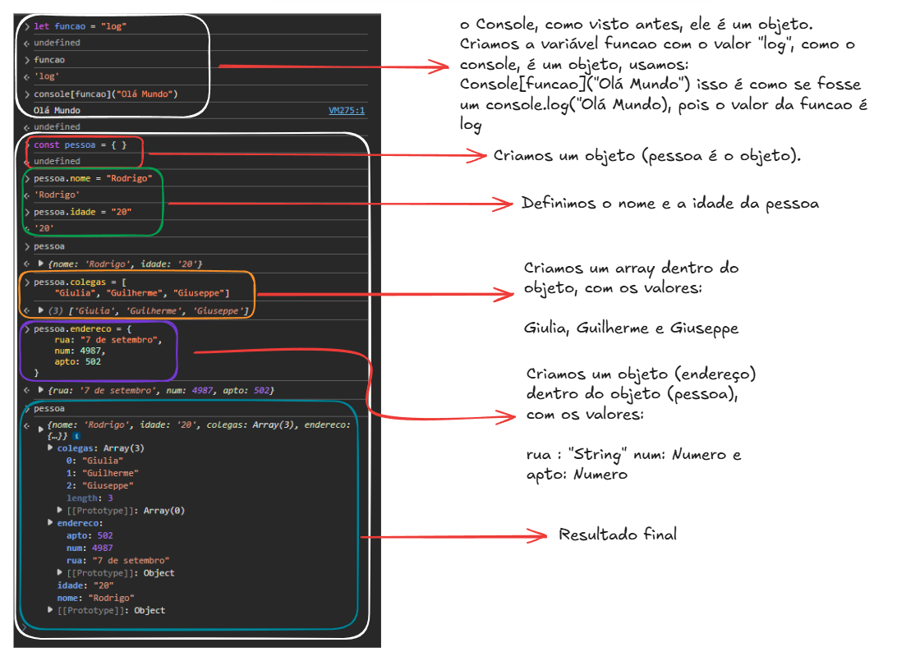

# Objetos

# É uma estrutura do JS para se trabalhar com dicionários chave-valor

# O par chave-valor em umum objeto javascript, é chamado de propriedade:

A chave é como um Nome da propriedade

O valor é o Valor que está armazenado nessa propriedade (semelhante aos valores armazenados em variáveis)

# Diferente dos arrays, seus elementos não possuem nenhuma sequência 

# Uma propriedade também pode ter strings, números e booleanos como chave

# Uma propriedade pode armazenar qualquer tipo de dado como valor

# Pode ser criado através de chaves {} - Exemplo: let objeto = {}

# Suas propriedades e funções podem ser referenciadas por encadeamento com ponto "." ou colchetes [] - Exemplos:

objeto.prop = "Olá Mundo"
objeto.executar()

let name = "prop"
objeto[name] = "Olá Mundo"
objeto.prop === objeto[name]
let funcao = "executar"
ubjeto[funcao]()

# Faça o Quiz 03