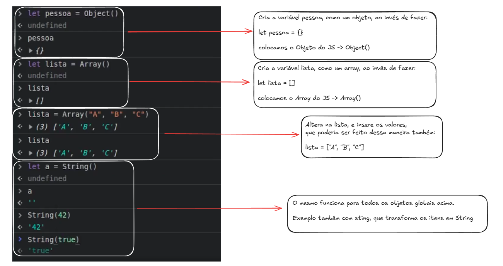
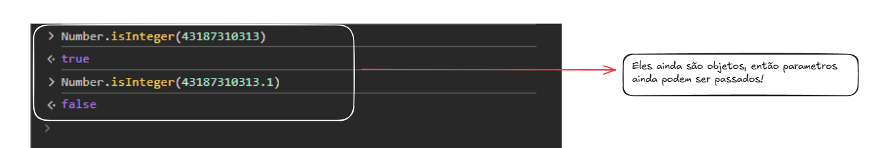
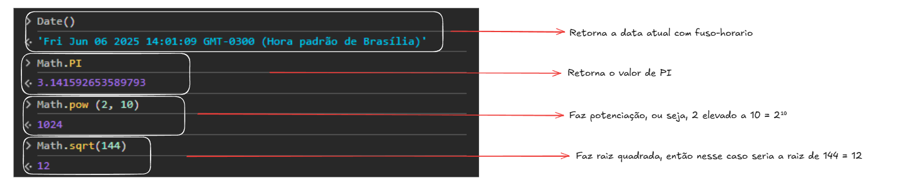

# Objetos Globais

# São objetos padrão da linguagem JS, que ficam sempre disponíveis para utilizarmos. Ou seja, eles ja vem prontos

# ATENÇÃO: não confundir com o objeto de escopo global window do navegador (ou o escopo global de outros ambientes)

# Alguns exemplos:

Object - Array - String - Number - Date - Math (todos usam letra maiuscula)

 Verifica se o numero é inteiro

 Math tem muitos recursos, confira numa documentação

# Podem ser usados para criar e converter valores

# Possuem propriedades e funções úteis e frequentemente necessárias